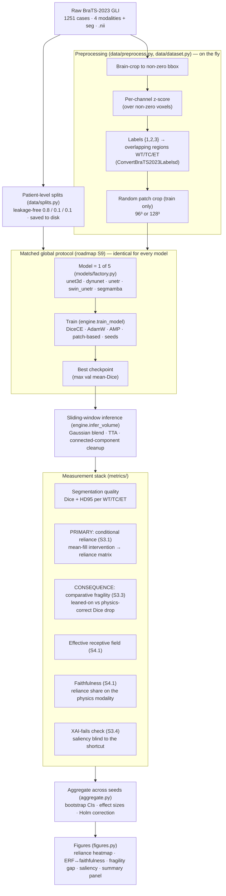

# BraTS-Trust — End-to-end pipeline (paper Methods)

This is the reproducible pipeline the study runs, from raw MRI to figures. It doubles as the
skeleton of the paper's Methods section. Stage numbers map to
`brain_tumor_roadmap_v4_final.md`; module paths point at the implementation.

## Flow

Every run is written to a timestamped `runs/<ts>__<name>/` with a config snapshot, `env.json`
(git hash + dirty flag + package versions + seeds), training curves, and tidy `results/`
tables — so any number in the paper is reproducible and traceable (see `docs/ARCHITECTURE.md`).

## Preprocessing (once per sample, in the dataloader)
BraTS-2023 ships **skull-stripped, co-registered, 1 mm isotropic**, so no registration or
resampling is needed (`preprocess.target_spacing: null`). We apply: brain-crop to the
non-zero bounding box; per-channel z-score over brain voxels; label conversion to the three
overlapping evaluation regions Whole Tumor / Tumor Core / Enhancing Tumor; and, for training,
a random cubic patch. The frozen input channel order is `[FLAIR, T1, T1CE, T2]`
(`constants.CHANNEL_ORDER`).

## The five models (each its own module under `models/`)
| Name | Module | Family | Role |
|------|--------|--------|------|
| `unet3d` | `models/unet3d.py` | CNN (ours) | RF-sweep model (Probe 3) + CNN anchor |
| `dynunet` | `models/dynunet.py` | CNN (nnU-Net) | Tier-A anchor |
| `unetr` | `models/unetr.py` | Transformer (ViT) | Tier-A anchor |
| `swin_unetr` | `models/swin_unetr.py` | Transformer (Swin) | Tier-A anchor |
| `segmamba` | `models/segmamba.py` | Mamba / state-space | Tier-A anchor (GPU-only) |

All share the channel contract and skip-alignment in `models/base.py` and are built by name
through `models.build_model`.

## Matched-protocol fairness (why the comparison is credible)
For any comparison across architectures, exactly **one** thing changes — the architecture.
`scripts/run_probe1.py` builds the train/val/test case lists **once** from the single saved
split and passes those same lists, plus the same preprocessing/optimizer/schedule/loss/patch
config, to every model. `experiments.run_single` seeds the RNG **after** constructing the
model but **before** iterating data, so model construction cannot perturb the data stream —
therefore **every architecture at a given seed sees the identical sequence of training
patches**. The chosen patch (96³ or 128³) satisfies every architecture's size constraints
(SwinUNETR ÷32 and ≥64³; UNETR ÷16). Reported with ≥3 seeds (exploratory) / ≥5 (confirmatory).

## Two experiments on top of this pipeline
- **Stage 2 — Probe 3 (receptive-field sweep, the decisive test):** one architecture
  (`unet3d`), three receptive-field variants (conv k3 / dwsep k5 / dwsep k7). Correlates ERF
  vs faithfulness across runs (`scripts/run_probe3.py` → `scripts/analyze_probe3.py`).
- **Stage 3 — Probe 1 (architecture sweep, generality):** the five models under the matched
  protocol (`scripts/run_probe1.py`), asking whether the (un)faithfulness pattern holds across
  model families. Swapping architecture changes several factors at once, so it is reported as
  a *contribution under matched protocol*, never a causal claim.
